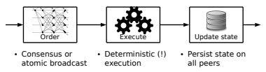
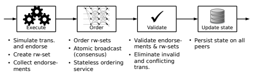
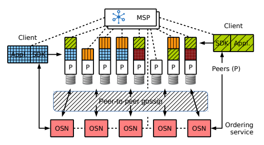
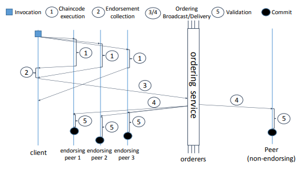
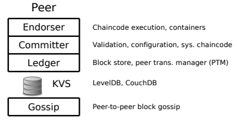

# Hyperledger Fabric:一个用于许可区块链的分布式操作系统

## 摘要

Fabric是一个模块化和可扩展的开源系统，用于部署和运行许可区块链，是Linux基金会托管的Hyperledger项目之一(www.hyperledger.org)。

Fabric是第一个用于运行分布式应用程序的真正可扩展的区块链系统。它支持模块化共识协议，这允许系统被定制为特定的用例和信任模型。Fabric也是第一个运行用标准的通用编程语言编写的分布式应用程序的区块链系统，不依赖于一种内置加密货币。这与现有的区块链平台形成了鲜明对比，后者要求用特定领域的语言编写智能合约，或者依赖于一种加密货币。Fabric使用可移植的成员概念来实现许可模型，该概念可以与行业标准的身份管理集成。为了支持这种灵活性，Fabric引入了一种全新的区块链设计，并改进了区块链应对不确定性、资源耗尽和性能攻击的方式。

本文描述了Fabric，它的架构，各种设计决策背后的基本原理，它最突出的实现方面，以及它的分布式应用程序编程模型。

## 1 介绍

区块链可以被定义为一个记录交易的不可变账本，在相互不信任的对等节点组成的分布式网络中进行维护。每个对等节点都有一份账本的副本。对等节点执行一个共识协议来验证交易，将它们打包进区块中，并在这些区块上建立一个哈希链。这一过程通过对交易进行排序来形成账本，这是保持一致性所必需的。区块链与比特币一起出现，被广泛认为是在数字世界运行可信交易的一种有前景的技术。

在一个公开的或不经许可的区块链中，任何人不需要一个特定的身份即可参与。公链通常涉及一种内置加密货币，并经常使用基于工作量证明(PoW)和经济激励的共识。另一方面，许可区块链在一组已知的、身份已识别的参与者之间运行一个区块链。
一个许可区块链提供了一种方法来保护具有共同目标但彼此不完全信任的一组实体之间的交互，例如交换资金、商品或信息的企业。通过依赖对等节点的身份，一个许可区块链可以使用传统的拜占庭容错(BFT)共识。

区块链可以以智能合约的形式执行任意、可编程的交易逻辑，以太坊就是一个例子。比特币中的脚本是这个概念的前身。一个智能合约的功能是作为一个受信任的分布式应用程序，它的安全性来自区块链和对等节点之间的底层共识。这与众所周知的使用状态机复制(state-machine replication,SMR)构建弹性应用程序的方法非常相似。然而，区块链与存在拜占庭缺陷的传统SMR有重要的不同:(1)不止一个，而是很多分布式应用同时运行;(2)应用程序可以由任何人动态部署;(3)应用程序代码是不受信任的，甚至是潜在恶意的。这些差异需要新的设计。

许多现有的智能合约区块链遵循SMR的蓝图，并实现了所谓的主动复制:一种共识或原子广播协议首先对交易进行排序，并将它们传播给所有对等节点即peers;然后，每个对等节点按顺序执行交易。我们称之为排序-执行架构;它要求所有对等节点执行每个交易，并且所有交易都是确定性的。排序-执行架构几乎可以在所有现有的区块链系统中找到，从公共的区块链系统，如以太坊(基于POW的共识)到许可的区块链系统(基于BFT类型的共识)，如Tendermint、Chain和Quorum。尽管排序-执行设计并不是在所有系统中都很明显，因为额外的交易验证步骤可能会模糊它，但它的局限性是所有系统中固有的:每个对等节点执行每个交易，并且交易必须是确定的。

之前的许可区块链存在许多限制，这些限制通常来自于无许可的区块链或使用排序-执行架构。尤其是：

* 共识是硬编码在平台内的，这与公认的没有通用的一刀切的共识协议的理解相矛盾

* 交易验证的信任模型由共识协议决定，不能适应智能合约的需求

* 智能合约必须用一种固定的、非标准的或领域特定的语言编写，这阻碍了广泛采用，并可能导致编程错误

* 所有对等节点对所有交易的顺序执行限制了性能，需要采取复杂的措施来防止来自不可信合约(例如在以太坊中使用gas机制)的针对平台的拒绝服务攻击。

* 交易必须是确定性的，这很难通过编程来确保

* 每个智能合约都在所有对等节点上运行，这违反机密性，并且禁止将合约代码和状态传播到对等节点的子集

本文描述了Hyperledger Fabric或简称Fabric，它是一个克服这些限制的开源区块链平台。Fabric是Linux基金会赞助的Hyperledger的项目之一。Fabric被用于超过400个原型、概念验证和生产分布式账本系统，跨越不同的行业和用例。这些用例包括但不限于争议解决、贸易物流、外汇净额、食品安全、合同管理、钻石来源、奖励点管理、低流动性证券交易和结算、身份管理和数字货币结算等领域。

Fabric引入了一个新的区块链架构，旨在实现弹性、灵活性、可伸缩性和机密性。设计成模块化和可扩展的通用许可区块链,Fabric是第一个区块链系统,以支持标准的编程语言编写的分布式应用程序的执行,在某种程度上,让它们在许多节点一致地执行,给人的印象就是执行在一个全球分布的区块链的计算机上。这使得Fabric成为第一个用于许可区块链的分布式操作系统。

Fabric的架构遵循了一种新的执行-排序-验证的范式，用于在不可信的环境中分布式地执行不可信的代码。它将交易流程分为三个步骤，可能运行在系统中的不同实体上:(1)执行一个交易并检查其正确性，从而对其进行背书(对应于其他区块链中的交易验证);(2)通过一个共识协议进行排序，而不考虑交易的语义;(3)根据特定于应用程序的信任假设进行交易验证，这也防止了由于并发而产生的竞态条件。

这种设计从根本上背离了排序-执行范式，Fabric通常在就交易的顺序达成最终共识之前执行交易。它结合了两种著名的复制方法，即被动复制和主动复制。

首先，Fabric使用分布式数据库中常见的被动或主备复制，但使用基于中间件的非对称更新处理，并将其移植到具有拜占庭故障的不受信任的环境中。在Fabric中，每个交易仅由对等节点的一个子集执行(背书)，这允许并行执行并解决潜在的不确定性，借助于执行-验证BFT复制。一个灵活的背书策略指定了哪些对等节点(或其中的多少个对等节点)需要担保一个给定智能合约的正确执行。

其次，Fabric合并了主动复制，在这种意义上，交易对账本状态的影响只有在它们之间的总顺序达成共识后才写入，在每个对等节点单独执行的确定性验证步骤中。这允许Fabric根据交易背书来尊重特定于应用程序的信任假设。此外，状态更新的排序被委托给一个模块化组件以达成共识(即原子广播)，它是无状态的，从逻辑上与执行交易和维护账本的对等节点分离。由于共识是模块化的，它的实现可以根据一个特定部署的信任假设进行量身定制。虽然可以很容易地使用区块链对等节点来实现共识，但这两个角色的分离增加了灵活性，并允许人们依赖完善的CFT(崩溃容错)或BFT排序工具包。

总的来说，这种混合复制设计(在拜占庭模型中混合被动复制和主动复制)和执行-排序-验证范式，代表了Fabric架构中的主要创新。它们解决了之前提到的问题，并使Fabric成为支持灵活信任假设的可扩展的许可区块链系统。

要实现这个架构，Fabric包含以下每个组件的模块化构建块：

* 一个排序服务会自动地向对等节点广播状态更新，并就交易的顺序建立共识

* 一个成员资格服务提供者负责将对等节点与加密身份关联起来。它保持了Fabric的许可性质

* 一个可选的点对点gossip服务向所有对等节点传播由排序服务输出的区块

* Fabric中的智能合约在一个容器环境中运行以实现隔离。它们可以用标准编程语言编写，但不能直接访问账本状态

* 每个对等节点通过只追加区块链的形式维护本地账本，作为一个键值存储中最新状态的一个快照。

本文的其余部分将描述Fabric的架构和相关经验。第2节总结了技术的现状，并解释了各种设计决策背后的基本原理。第3节详细介绍了Fabric的架构和执行-排序-验证方法，并说明了交易执行流。在第4节中，定义了Fabric的关键组件，特别是排序服务、成员资格服务、点对点gossip、账本数据库和智能合约API。

## 2 背景

### 2.1 区块链的排序-执行架构

所有以前的区块链系统，无论是否是许可链，都遵循排序-执行架构。这意味着区块链网络首先使用一个共识协议来对交易排序，然后在所有对等节点上以相同的顺序依次执行交易。

例如，基于POW的无许可区块链(如以太坊)将交易的共识和执行结合如下:(1)每个对等节点(即参与共识的节点)组装一个包含有效交易的区块(为了建立有效性，该对等节点已经预先执行了这些交易);(2)对等节点试图解决一道PoW难题;(3)如果对等节点很幸运并解决了这个难题，它就会通过一个gossip协议将这个区块传播到网络上;(4)每个接收到该区块的对等节点验证该难题的解和该区块中的所有交易。实际上，每个对等节点因此重复执行幸运对等节点的第一步。此外，所有对等节点都按顺序执行交易(在一个区块内和跨区块)。排序-执行架构如图1所示。

现有的许可区块链，如Tendermint、Chain或Quorum，通常使用PBFT或其他原子广播协议提供的BFT共识。然而，它们都遵循相同的排序-执行方法，并实现了经典的主动SMR。

_图1:复制服务中的排序-执行架构_

### 2.2 排序-执行的局限性

排序-执行架构在概念上很简单，因此也得到了广泛的应用。然而，当在一个通用的允许区块链中使用时，它有几个缺点。下面我们讨论三个最重要的问题。

顺序执行。在所有对等节点上按顺序执行交易会限制区块链能够实现的有效吞吐量。特别是，由于吞吐量与执行延迟成反比，这可能成为除了最简单的智能合约之外的所有智能合约的性能瓶颈。此外，回想一下，与传统SMR相比，区块链形成了一个通用的计算引擎，它的有效载荷应用程序可能被一个对手部署。拒绝服务(DoS)攻击会严重降低这样的区块链的性能，它会引入需要很长执行时间的智能合约。例如，执行一个无限循环的智能合约具有致命的影响，但不能被自动检测到，因为程序停止问题是不可解的。

为了解决这个问题，公共的自带一种原生加密货币的可编程区块链对执行成本负有责任。例如，以太坊引入了交易执行所消耗的gas的概念，gas通过gas价格转换为加密货币的成本，并向交易的发送者收费。以太坊花了很长时间来支持这个概念，为每个底层计算步骤分配成本，引入自己的VM来控制执行。虽然这似乎是公共区块链的可行解决方案，但在没有原生加密货币的通用系统的许可模型中，这是不够的。

与顺序执行相比，分布式系统的文献提出了许多种提高性能的方法，例如通过并行执行不相关的操作。不幸的是，这些技术仍未在智能合约的区块链上下文中成功应用。例如，一个挑战是需要确定地推断智能合约中的所有依赖关系，这在结合可能的机密性约束时尤其具有挑战性。此外，这些技术对来自不受信任的开发人员的合约代码的DoS攻击毫无帮助。

非确定性的代码。排序-执行架构的另一个重要问题是非确定性交易。在主动SMR中，共识后执行的操作必须是确定的，否则分布式账本就会分叉并违反区块链的基本前提，即所有对等节点都保持相同的状态。这通常是通过用领域特定语言(如以太坊Solidity)来编程来解决的，这些语言对其应用程序有足够的表达能力，但仅限于确定性执行。然而，这样的语言对于实现者很难设计，并且需要智能合约程序员额外的学习成本。相反，用通用语言(如Go、Java、C/C++)编写智能合约显得更有吸引力，并加速了区块链解决方案的采用。

不幸的是，通用语言为确保确定性执行带来了许多问题。即使应用程序开发人员没有引入明显的不确定性操作，隐藏的实现细节也会产生同样的破坏性影响(例如，Go中的map迭代器是不确定性的)。更糟糕的是，在区块链上，创建确定性应用程序的重担落在潜在的不受信任的程序员身上。只要有一个恶意创建的非确定性合约就足以让整个区块链停止运行。在区块链上过滤分叉操作的模块化解决方案也被研究过，但在实践中似乎成本很高。

执行的机密性。根据公共区块链的蓝图，许多许可区块链在所有对等节点上运行所有智能合约。然而，许多许可区块链的预期用例都要求机密性，即对智能合约的逻辑、交易数据或账本状态的访问可以受到限制。尽管从数据加密到高级零知识证明和可验证计算等加密技术可以帮助实现机密性，但这通常会带来相当大的开销，并且在实践中不可行。

幸运的是，它足以将相同的状态传播给所有对等节点，而不是到处运行相同的代码。因此，一个智能合约的执行可以被限制在该任务所信任的对等节点的子集，这些对等节点保证了执行的结果。这种设计从主动复制转向被动复制的变体，适应于区块链的信任模型。

### 2.3 现有架构的进一步限制

固定的信任模型。大多数许可区块链依赖于异步BFT复制协议来建立共识。这样的协议通常依赖于一个安全假设，即在n > 3f对等节点中，直到f都可以容忍故障和拜占庭错误。在相同的安全假设下，相同的节点通常也会执行应用程序(即使实际上可以将BFT的执行限制在更少的节点上)。然而，这种确定数量的信任假设(不管系统中的对等节点角色如何)可能与执行智能合约所需的信任不匹配。在一个灵活的系统中，应用程序级别的信任不应该固定为协议级别的信任。通用的区块链应该解耦这两个假设，并允许应用程序灵活的信任模型。

硬编码的共识。Fabric是第一个引入可插拔共识的区块链系统。在Fabric出现之前，几乎所有的区块链系统，无论是否是许可链，都带有一个硬编码的共识协议。然而，几十年来对共识协议的研究表明，并没有这种一刀切的万全的解决方案。例如，当部署在潜在的具有对抗性的环境中时，BFT协议的性能差别很大。具有链通信模式的协议在具有对称和同构链路的局域网集群中表现出可证明的最佳吞吐量，但在广域、异构网络中性能下降严重。此外，在给定的部署中，负载、网络参数和实际故障或攻击等外部条件可能随时间而变化。由于这些原因，BFT共识应该是可重新配置的，并理想地动态适应变化的环境。另一个重要方面是将协议的信任假设与一个给定的区块链部署场景匹配。事实上，人们可能想要用基于一个替代信任模型(如XFT)的协议或者CFT协议(如Paxos/Raft和ZooKeeper)，甚至是无许可协议来替换BFT共识。

### 2.4 排序-执行区块链的经验

在实现Fabric的执行-排序-验证架构之前，Fabric团队就获得了用排序-执行模型构建一个许可区块链平台的经验，使用PBFT达成共识。也就是说，Fabric以前的版本(直到2016年9月发布的v0.6)都遵循传统的排序-执行架构。

从许多概念验证应用中获得的反馈来看，这种方法的局限性立即变得清晰起来。例如，用户经常在对等节点上观察到不同和分叉的状态，并报告共识协议中的bug;在所有情况下，仔细检查发现，罪魁祸首是不确定性的交易代码。还有一些抱怨是针对有限的性能，例如，每秒只有5个交易，用户承认他们的交易平均需要200毫秒才能执行。一个区块链系统的关键属性，即一致性、安全性和性能，不能依赖于区块链系统的用户的知识和善意，特别是区块链应该在不受信任的环境中运行。

## 3 架构

在本节中，我们将介绍三阶段的执行-排序-验证架构，然后解释交易流。

### 3.1 Fabric概述

Fabric是一个分布式操作系统，用于执行用通用编程语言(如Go、Java、Node.js)编写的分布式应用程序。它在一个只可追加的复制的账本数据结构中安全地跟踪其执行历史，并且没有内置加密货币。

Fabric引入了执行-排序-验证区块链架构(如图2所示)，并且不遵循标准的排序-执行设计，原因已在第2节中解释。简而言之，Fabric的一个分布式应用程序由两部分组成：

* 一个被称为chaincode即链码的智能合约，它是实现应用程序逻辑并在执行阶段运行的程序代码。链码是Fabric中分布式应用程序的核心部分，可以由不受信任的开发人员编写。为了管理区块链系统和维护参数，存在特殊的链码，统称为系统链码(第4.6节)。

_图2:Fabric的执行-排序-验证架构(rwset表示一个读集和一个写集，见3.2节)_

* 一个在验证阶段评估的背书策略。不受信任的应用程序开发人员不能选择或修改背书策略。一个背书策略在Fabric中充当交易验证的一个静态库，它只能由链码进行参数化。只有指定的管理员才有权限通过系统管理函数修改背书策略。一个典型的背书策略让链码以背书所需要的一组对等节点的形式指定一个交易的背书者;它使用集合的逻辑表达式，例如“五分之三”或“(A ∧ B) ∨ C”。自定义背书策略可以实现任意逻辑(例如，第5.1节中受比特币启发的加密货币)。

一个客户端向背书策略指定的对等节点发送事务。然后，每个交易由特定的对等节点执行，并记录其输出;这个步骤也称为背书。执行之后，交易进入排序阶段，该阶段使用一个可插拔的共识协议来生成一个完全有序的组合在区块中的经过背书的交易序列。在(可选)gossip的帮助下，这些信息会传播给所有的对等节点。与完全对交易输入进行排序的标准的主动复制不同，Fabric结合状态依赖项对交易输出进行排序，就像在执行阶段计算的那样。然后，每个对等节点在验证阶段根据背书策略验证来自背书交易的状态更新，以及验证执行的一致性。所有对等节点都以相同的顺序验证交易，并且验证是确定性的。在这个意义上，Fabric在拜占庭模型中引入了一种新的混合复制范式，它结合了被动复制(状态更新的共识前计算)和主动复制(执行结果和状态更新的共识后验证)。

一个Fabric区块链由一组组成网络的节点组成(见图3)。由于Fabric是允许链，所有参与网络的节点都有一个身份，由模块化的成员资格服务提供商(MSP)提供(第4.1节)。Fabric网络中的节点扮演三种角色之一：

* 客户端提交交易提案（transaction proposals）以执行，帮助编排执行阶段，最后广播交易以进行排序

* 对等节点执行交易提案并验证交易。所有对等节点都维护区块链账本，这是一个只能追加的数据结构，以一个哈希链的形式记录所有交易和状态，即最新账本状态的简洁表示。不是所有的对等节点都执行所有的交易提案，只有其中的一个子集称为背书对等节点(或者简单地说，背书者)执行，这是由交易所归属的链码的策略指定的

* 排序服务节点(Ordering Service Nodes,OSN)(或简单地说，排序者)是共同构成排序服务的节点。简而言之，排序服务建立Fabric中所有交易的总顺序，其中每个交易包含在执行阶段计算的状态更新和依赖，以及背书对等节点的加密签名。排序者完全不知道应用程序的状态，也不参与交易的执行和验证。这种设计选择使Fabric中的共识尽可能模块化，并简化了共识协议在Fabric中的替换。

_图3:使用联盟MSPs的Fabric网络，并运行多个(不同的阴影和颜色)链码，根据策略选择性地安装在对等节点上_

一个Fabric网络实际上支持连接到同一个排序服务的多个区块链。每一个这样的区块链被称为一个通道（channel），并且可能由不同的对等节点作为它的成员。通道可以用来分隔区块链网络的状态，但是跨通道的共识是不协调的，并且每个通道的交易总顺序与其他通道是分开的。将所有排序者视为受信任的部署还可以为对等节点实现按通道的访问控制。下面我们只简单介绍一下通道，集中讨论一个单独的通道。

在接下来的三个部分中，将解释Fabric中的交易流(如图4所示)，并说明执行、排序和验证阶段的步骤。然后，总结了Fabric的信任和故障模型(第3.5节)。

### 3.2 执行阶段

在执行阶段，客户端签署交易提案并将交易提案(或简单地说，提案)发送给一个或多个背书者以执行。回想一下，每个链码都通过背书策略隐式地指定了一组背书者。一个提案包含提交客户端的身份(根据MSP),交易负载（包含执行的一个操作、参数，链码的标识符，每个客户端只使用一次的一个nonce，比如一个计数器或一个随机值），和一个交易标识符（来源于客户端标识符和nonce）。

_图4:Fabric交易流_

背书者通过对已安装在区块链上的指定链码执行操作来模拟提案。chaincode运行在一个Docker容器中，与主背书者进程隔离。

一个提案是针对背书者的本地区块链状态模拟的，不需要与其他对等节点同步。此外，背书者不将模拟结果持久化到账本状态。区块链的状态是由对等节点交易管理器(peer transaction manager,PTM)以版本化的键值对存储的形式来维护的，在这个存储中，对一个键的连续更新的版本号单调递增(第4.4节)。一个链码创建的状态只适用于该链码，不能被另一个链码直接访问。注意，链码不应该在程序代码中维护本地状态，只应该在区块链状态中维护通过GetState、PutState和DelState操作访问的状态。给定适当的权限，一个链码可以调用另一个链码来访问同一个通道内的状态。

作为模拟的结果,每个背书者产生一个writeset写集，包括模拟产生的状态更新（例如，对一个key的value进行的修改），以及一个readset读集，代表提案模拟的版本依赖（例如，在模拟期间读取的所有keys和它们的版本号）。模拟结束之后，背书者以加密方式签名一条名为endorsement的消息，该消息包含readset和writeset(以及交易ID、背书者ID和背书者数字签名等元数据)，并在提案响应中将其发送回客户端。客户收集背书直到它们满足该交易调用的链码的背书策略(见3.4节)。特别地，这需要由背书策略决定的所有背书者产生相同的执行结果(即相同的readset和writeset)。然后，客户端继续创建交易并将其传递给排序服务。

关于设计选择的讨论。由于背书者在不与其他背书者同步的情况下对提案进行模拟，两个背书者可能会在账本的不同状态上执行提案，并产生不同的输出。对于要求多个背书者产生相同结果的标准背书策略，这意味着在访问相同keys的操作的高度竞争下，客户端可能无法满足背书策略。与通过中间件进行同步的复制数据库中的主备复制相比，这是一个新的考虑因素:假定在一个区块链中任何单个对等节点执行的结果是不受信任的。

Fabric团队有意识地采用了这种设计，因为它大大简化了架构，对于典型的区块链应用程序来说已经足够了。正如比特币的方法所展示的那样,分布式应用程序可以这样规划，即访问相同状态的操作可以减少争用，或者在正常情况下完全消除争用(例如在比特币中，修改同一个对象的两个操作是不允许的，这代表了双花攻击)。在未来，Fabric团队计划逐步增强Fabric在争用（竞态条件）下的活性语义，特别是支持CRDTs来补充当前版本依赖检查，以及作为交易排序器的每个链码的lead-endorser。

在排序阶段之前执行一个交易对于容忍不确定性的链码是至关重要的(参见第2节)。Fabric中的带有不确定性交易的链码只会危及其自身操作的活性，例如，因为客户端可能没有收集到足够数量的背书。这是相对于排序-执行架构的一个基本优势，在排序-执行架构中，不确定性操作会导致对等节点的状态不一致。

最后，容忍不确定执行还可以解决来自不可信链码的DoS攻击，因为如果一个背书节点怀疑一个执行是DoS攻击，这个背书节点可以根据本地策略简单地中止这个执行。这不会危及系统的一致性，而且，在排序-执行架构中，这种单方面的执行失败是不可能的。

### 3.3 排序阶段

当一个客户端收集了一个提案的足够背书时，它就会组装一个交易并将其提交给排序服务。交易包含交易有效负载(即包含参数的链码操作)、交易元数据和一组背书。排序阶段对每个通道上提交的所有交易建立一个总排序/顺序。换句话说，排序原子地广播背书，从而在交易上建立共识，尽管有错误的排序节点。此外，排序服务将多个交易批量打包成区块，并输出包含一个交易的哈希链区块序列。将交易打包成区块可以提高广播协议的吞吐量，这是一种常用的容错广播技术。

从高层次来看，排序服务的接口只支持对等节点调用并由一个通道标识符隐式参数化的以下两种操作：

* broadcast(tx):一个客户端调用此接口来广播一个任意交易tx，该交易通常包含交易有效负载和客户端的签名，以进行传播。

* B ← deliver(s):一个客户端调用这个接口来获取区块B的非负序列号s。这个区块包含了一个交易列表[tx1, . . . ,txk]和一个哈希链值h，表示这个区块的序列号为s-1，即B =([tx1, . . . ,txk],h)。由于客户端可能多次调用这个接口，并且总是在它可用的时候返回相同的区块，我们说对等节点在调用deliver(s)后第一次接收到区块B时发送序号为s的区块B。

排序服务确保在一个通道上delivered的区块完全被排序。更具体地说，排序确保了每个通道的以下安全特性：

* 共识:在正确的对等节点（peers）上，对于任意两个区块，比如以序列号s deliver的区块B和以序列号s′ deliver的区块B'，只要s = s′，那么B一定等于B'。

* 哈希链完整性:如果某个正确的对等节点deliver了序号为s的区块B，另一个正确的对等节点deliver了序号为s+1的区块B' = ([tx1, . . . ,txk],h′)，则h′ = H(B)，其中H(·)表示加密哈希函数。

* 不能跳过:如果一个正确的对等节点p deliver了一个序号为s(s>0)的区块，那么对于每个i = 0, . . . ,s − 1，对等节点p已经deliver了一个需要为i的区块。

* 没有创建:当一个正确的对等节点deliver序号为s的区块B时，那么对于每个tx ∈ B，某个客户端已经广播了tx。

对于活性，排序服务至少支持以下“最终”属性：

* 有效性:如果一个正确的客户端调用了broadcast(tx)，那么每个正确的对等节点最终都会deliver一个包含tx的带有序号的区块B。

然而，允许每个单独的排序实现都具有自己的活性和对客户端请求的公平性保证。

由于在区块链网络中可能有大量的对等节点，但只有相对较少的节点实现了排序服务，Fabric可以配置为使用内置的gossip服务来传播从排序服务deliver到所有对等节点的区块(第4.3节)。gossip的实现是可扩展的，并且与排序服务的特定实现无关，因此它可以与CFT和BFT排序服务一起工作，以确保Fabric的模块化。

排序服务还可以执行访问控制检查，以查看一个客户端是否被允许在一个给定的通道上广播消息或接收区块。这个特性和排序服务的其他特性将在4.2节中进一步解释。

关于设计选择的讨论。非常重要的一点是，排序服务不维护区块链的任何状态，也不验证或执行交易。这个架构是Fabric的一个关键的、起决定性作用的特性，并使Fabric成为第一个完全将共识与执行和验证分离开来的区块链系统。这使得共识尽可能模块化，并支持实现排序服务的共识协议的生态系统。哈希链完整性属性和区块链的存在只是为了使对等节点对区块序列的完整性校验更加高效。最后，请注意，我们不需要排序服务来防止交易重复。这简化了它的实现，并且不需要担心，因为重复的交易在校验过程中会被对等节点在read-write检查中过滤。

### 3.4 校验阶段

区块直接通过排序服务或通过gossip被deliver给对等节点。然后，一个新区块进入校验阶段，该阶段由三个连续的步骤组成：

1. 背书政策的评估并行地发生在区块内的所有交易中。评估是所谓的校验系统链码(VSCC)的任务，这是一个静态库，是区块链配置的一部分，负责根据链码配置的背书策略对背书进行校验(见4.6节)。背书不满足的，该交易被视为无效，其影响将被忽略。

2. 对区块中的所有交易按顺序进行读写冲突检查。对于每个交易，它将readset字段中的键的版本与对等节点本地存储的账本的当前状态中的键的版本进行比较，并确保它们仍然相同。如果版本不匹配，事务将被标记为无效，其影响将被忽略。

3. 账本更新阶段最后运行，在这个阶段中，区块被追加到本地存储的账本，并且区块链状态被更新。特别是，当将区块添加到账本时，前两个步骤中的有效性检查结果也会以位掩码的形式保存下来，表示区块中有效的交易。这有利于以后状态的重建。此外，所有状态更新都是通过将writeset中的所有键值对写入本地状态来实现的。

Fabric中的默认VSCC允许在为要表达的链码配置的背书节点集合上使用单调的逻辑表达式。VSCC评估验证通过交易背书上的有效签名表示的对等节点集满足表达式。然而，不同的VSCC策略可以静态配置。

关于设计选择的讨论。Fabric的账本包含了所有的交易，包括那些被认为无效的交易。这是从整体设计中得出的，因为排序服务(与链码的状态无关)负责产生区块链，而且校验是在共识一致后由对等节点完成的。该特性在某些需要在后续审计中跟踪无效交易的用例中是必需的，并与其他区块链(如比特币和以太坊)形成对比，在这些区块链中，账本只包含有效交易。此外，由于Fabric的许可性质，检测试图通过无效交易在网络中泛滥来实施DoS攻击的客户端是很容易的。一种方法是根据可能实施的策略将这些客户端列入黑名单。此外，特定的部署可以实现交易费用来对交易调用收费，这将使DoS攻击代价高昂。

### 3.5 信任与故障模型

Fabric可以适应灵活的信任和故障假设。通常，任何客户端都被认为是潜在恶意的或拜占庭式的。对等节点被分组到组织内，每个组织形成一个信任域，这样一个对等节点可以信任其组织中的所有对等节点，但不信任其他组织的对等节点。排序服务将所有对等节点(和客户端)视为潜在的拜占庭。

Fabric网络的完整性依赖于排序服务的一致性。排序服务的信任模型直接依赖于它的实现(见3.3节)。从版本v1.0.6开始，Fabric支持用于开发和测试的集中式单节点实现，以及运行在集群上的CFT排序服务。第三种实现是基于BFT-SMaRt的概念验证，它最多可以容忍三分之一的拜占庭OSNs。

注意Fabric将应用程序的信任模型与共识的信任模型解耦。也就是说，一个分布式应用程序可以定义自己的信任假设，这些信任假设通过背书策略传递，并且独立于排序服务实现的共识假设(另见3.4节)。

## 4 Fabric组件

Fabric是用Go编写的，并使用gRPC框架在客户端、对等节点和排序节点之间进行通信。下面我们将更详细地描述一些重要的组件。图5显示了一个对等节点的组件。

_图5:一个Fabric对等节点的组件_

### 4.1 成员资格服务

成员资格服务提供者(MSP)维护系统中所有节点(客户端、对等节点和OSNs)的身份，并负责颁发用于身份验证和授权的节点证书。由于Fabric是许可链，节点之间的所有交互都是通过经过身份验证的消息进行的，通常带有数字签名。成员资格服务由每个节点上的一个组件组成，它可以验证交易、验证交易的完整性、签署和验证背书，以及验证其他区块链操作。密钥管理和节点注册的工具也是MSP的一部分。

MSP是一个可以进行不同实例化的抽象。Fabric中的默认MSP实现处理基于数字签名的认证的标准PKI方法，并且可以适应商业证书颁发机构(CAs)。Fabric也提供一个独立的CA，称为Fabric-CA。此外，还设想了另一种MSP实现，例如依赖匿名证书授权一个客户端调用一个交易，而不需要将交易链接到一个身份。

Fabric允许两种模式来建立一个区块链网络。在离线模式下，证书由一个CA生成，并分发到带外的所有节点。对等节点和排序节点只能在离线模式下注册。对于enrolling客户端，Fabric-CA提供了一种在线模式，该模式向客户端颁发加密证书。MSP配置必须确保所有节点，特别是所有对等节点，都能识别相同的身份和身份验证。

MSP允许身份联盟，例如，当多个组织操作一个区块链网络时。每个组织向自己的成员颁发身份，每个对等节点能识别所有组织的成员。这可以通过多个MSP实例化来实现，例如，通过在每个组织和一个MSP之间创建一个映射。

### 4.2 排序服务

排序服务管理多个通道。在每个通道上，它都提供以下服务：

1. 原子广播用于建立交易顺序，实现broadcast和deliver调用(第3.3节)。

2. 重新配置一个通道，当它的成员通过广播一个配置更新交易来修改通道(第4.6节)。

3. 可选地，在排序服务充当一个受信任实体的那些配置中，进行访问控制，限制向指定的客户端和对等节点广播交易和接收区块。

使用系统通道上的一个创世区块引导排序服务。该区块携带一个定义排序服务属性的配置交易。

当前的生产实现由排序服务节点(OSNs)组成，这些节点实现这里描述的操作，并通过系统通道进行通信。实际的原子广播功能是由Apache Kafka的一个实例提供的，该实例基于ZooKeeper提供了可伸缩的发布-订阅消息和强一致性，即使节点崩溃。Kafka可能运行在与OSNs分离的物理节点上。OSNs作为对等节点与Kafka之间的代理。

一个OSN直接将一个新接收到的交易注入到原子广播(例如，发往Kafka broker)。OSNs把从原子广播接收到的交易打包并形成区块。只要满足以下三种条件之一，一个区块就会被切割:(1)该区块包含指定的最大交易数;(2)区块已经达到最大大小(以字节为单位);或者(3)从接收到新区块的第一个交易已经过去了一段时间，如下所述。

这个打包过程是确定的，因此在所有节点上产生相同的区块。鉴于从原子广播接收到的交易流，很容易看出前两个条件是非常确定的。在第三种情况中，为了确保确定性的区块产生，一个节点在从原子广播中读取区块中的第一个交易时启动一个计时器。如果在计时器到期时区块还没有切割，OSN会在通道上广播一个特殊的time-to-cut交易，这表示它打算切割的区块的序列号（区块号）。另一方面，每个OSN在接收到给定区块号的第一个time-to-cut交易时，都会立即切割一个新区块。由于该交易以原子方式deliver给所有已连接的OSNs，它们都包含区块中相同的交易列表。OSNs直接将最近deliver的区块持久化到它们的文件系统中，因此它们可以通过deliver响应对等节点对区块的检索。

基于Kafka的排序服务是目前可用的三种实现之一。称为Solo的一个中心化orderer在一个节点上运行，用于开发。基于BFT-SMaRt的一个概念验证排序服务也已提供;它确保原子广播服务，但还不支持重新配置和访问控制。这说明了Fabric中共识的模块化。

### 4.3 Peer Gossip

分离执行、排序和校验阶段的一个优点是它们可以独立地扩展。然而，由于大多数共识算法(在CFT和BFT模型中)是受带宽限制的，排序服务的吞吐量受到其节点的网络能力的限制。共识不能通过增加更多的节点来扩展，相反，吞吐量会下降。然而，由于排序和校验是解耦的，我们感兴趣的是在排序阶段之后，高效地将执行结果传播给所有对等节点进行校验。这一点，以及向新加入的对等节点和断开连接很长时间的对等节点的状态转移，正是gossip组件的目标。Fabric gossip利用epidemic multicast实现此目的。区块由排序服务签名。这意味着一个对等节点在接收到所有区块后，可以独立地组装区块链并验证其完整性。

用于gossip的通信层基于gRPC，并利用TLS进行双向身份验证，使每一方都能将TLS证书绑定到远端对等节点的身份。gossip组件维护系统中在线对等节点的最新成员视图。所有对等节点都独立地从定期传播的成员(membership)数据构建一个本地视图。此外，一个对等节点可以在崩溃或网络中断后重新连接到视图。

Fabric gossip使用两个阶段进行信息传播:在push过程中，每个对等节点从成员视图中随机选择一组活跃的邻居，并将消息转发给它们;在pull过程中，每个对等节点定期探测一组随机选择的对等节点，并请求丢失的消息。已经证明，结合使用这两种方法对于优化利用可用带宽和确保所有对等节点以高概率接收所有消息至关重要。为了减少从排序节点向网络发送区块的负载，协议还选举了一个leader peer，它作为代表从排序服务pull区块并发起gossip分发。这种机制对于leader失败的场景是有弹性的。

### 4.4 账本

每个对等节点的账本组件维护账本和持久存储上的状态，并启用模拟、校验和账本更新等阶段。一般来说，它由一个区块存储和一个对等节点交易管理器组成。

账本区块存储持久化交易区块，并作为一组仅能追加的文件实现。由于区块是不可变的，并且到达的顺序是确定的，所以只可追加的结构可以获得最大的性能。此外，区块存储维护一些索引，用于随机访问一个区块或一个区块中的一个交易。

对等节点交易管理器(peer transaction manager,PTM)在版本控制的键值存储中维护最新状态。它为每个由链码存储的唯一的入口键存储一个元组的形式(key, val, ver)，包含它最近存储的值val和它的最新版本ver。版本由区块号和区块中的存储了该条目的交易序列号组成。这使得版本唯一且单调递增。PTM使用一个本地键值存储来实现其版本化的变体，实现使用LevelDB(用Go开发的)和Apache CouchDB。

在模拟一个交易的过程中，PTM为交易提供最新状态的一个稳定快照。正如在3.2节中提到的，PTM在readset中为GetState访问的每个条目记录一个元组(key, ver)，在writeset中为交易使用PutState更新的每个条目记录一个元组(key, val)。此外，PTM支持范围查询，为此它计算查询结果(一组元组(key, ver))的加密哈希，并将查询字符串本身和哈希添加到readset。

对于交易校验(第3.4节)，PTM按顺序校验一个区块中的所有交易。这将检查一个交易是否与之前的任何交易(当前区块内或更早)冲突。对于readset中的任何键，如果readset中记录的版本与最新状态下的版本不同(假设所有之前的有效交易都已提交)，则PTM将该交易标记为无效。对于范围查询，PTM将重新执行该查询，并将哈希与readset中的哈希进行比较，以确保不会发生幻读。这种读写冲突语义导致了单副本的可串行性。

账本组件可以容忍在账本更新期间peer崩溃，如下所示。在接收到一个新的区块后，PTM已经在区块内执行了校验并使用3.4节中提到的位掩码标记交易为有效或无效。账本现在将区块写入账本区块存储，并将其刷新到磁盘，随后更新区块存储索引。然后，PTM将所有有效交易的writeset状态更改应用到本地的版本化存储。最后，它计算并保存一个值savepoint，它表示成功应用（即把区块中的有效交易的状态更新提交）的最大区块号。值savepoint用于在从崩溃中恢复时从持久化区块中恢复索引和最新状态。

### 4.5 链码执行

链码是在一个与peer的其他部分松耦合的环境中执行的，该环境支持添加新的链码编程语言的插件。目前支持Go、Java和Node。

在一个Docker容器环境中，每个用户级或应用程序链码运行在一个单独的进程中，它将链码彼此隔离，也将链码与peer隔离。这也简化了链码生命周期的管理(例如，启动、停止或退出链码)。链码和peer使用gRPC消息通信。通过这种松耦合，peer与实现链码的实际编程语言无关。

与应用程序链码不同，系统链码直接运行在peer进程中。系统链码可以实现Fabric所需的特定功能，并可用于用户链码之间的隔离过度受限的情况。关于系统链码的更多细节将在下一节中给出。

### 4.6 配置和系统链码

Fabric是通过通道配置和被称为系统链码的特殊链码定制的。

Fabric中的每个通道形成一个逻辑区块链。一个通道的配置以元数据的形式保存在特殊的配置区块中。每个配置区块包含完整的通道配置，不包含任何其他交易。每个区块链都以一个被称为创世区块的配置区块开始，该配置区块用于引导通道。通道配置包括:(1)参与节点MSPs的定义,(2)OSNs的网络地址,(3)共识实现和排序服务的共享配置,如打包batch大小和timeouts,(4)控制访问排序服务操作(broadcast和deliver)的规则和(5)控制通道配置的每个部分可以被怎么修改的规则。

可以使用一个通道配置更新交易更新一个通道的配置。该交易包含要对配置进行的更改的表示，以及一组签名。排序服务节点通过使用当前配置来验证修改是否使用对应的一组签名进行了授权从而评估更新是否有效。orderers然后生成一个新的配置区块，它嵌入了新的配置和配置更新交易。接收到该区块的对等节点将验证配置更新是否是基于当前配置授权的;如果有效，则更新它们的当前配置。

应用程序链码是通过引用背书系统链码(ESCC)和校验系统链码(VSCC)来部署的。选择这两个链码，以便ESCC的输出(一个背书)可以作为VSCC输入的一部分进行验证。ESCC将一个提案和提案模拟结果作为输入。如果结果符合要求，ESCC将生成一个响应，包含结果和背书。对于默认ESCC，这种背书只是对等节点的本地签名身份的一个签名。VSCC接受一个交易作为输入，并输出该交易是否有效。对于默认的VSCC，将根据为链码指定的背书策略收集和评估背书。此外，系统链码还实现其他支持功能，如链码生命周期。

